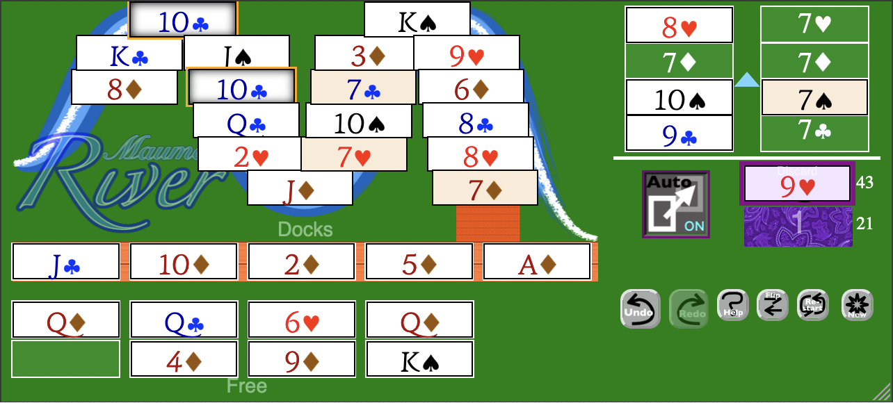
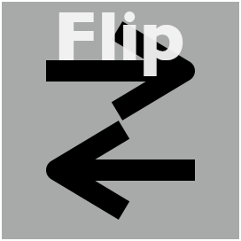
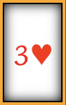
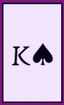

# Maumee River Solitaire
## About the Game
Maumee River Solitaire is based on the card game <A HREF="https://en.wikipedia.org/wiki/Herring-Bone_(card_game)">Herringbone</A>. It is named after the Maumee River in Ohio, which flows through Toledo, Ohio where I live.  Features of this version include a compact layout that changes the card size to maximize playability on any screen, an autoplay feature, and highlighting of root and duplicate cards in the river

This code uses <A HREF="https://capacitorjs.com">CapacitorJS</A> to wrap a previously written <A HREF="https://github.com/sahi1l/MaumeeRiverSolitaire">web app I wrote</A> for mobile use.  The game itself is written in Javascript and CSS.

## How to Play
- Download the code, and run the command `npm run preview`
- Sideload `maumee.apk` to your Android device.
- The HTML, javascript, and CSS are in the `dist/` folder, and can run by pointing a web browser at `dist/index.html`.
- An older version of the game can be found <A HREF="https://sahi1l.github.io/MaumeeRiverSolitaire/">on Github Pages</A>.
- If you make any changes, you can regenerate the APK by typing `npm run apk`.

## Screenshots
<table><tr>
<td>Game in left-handed portrait orientation.</td>
<td>Game in right-handed landscape orientation.  (The cards are horizontal to make it easier to grab them.)</td></td>
</tr>
</table>

## Rules
- Played with two standard 52-card decks.
- **Goal:** Build up the eight wrap-around *foundations* by suit.  You can play a card to the foundation by clicking on it or dragging it to the appropriate spot. The player may choose to build the foundations upward or downward starting from the *base card*; a blue arrow appears once the direction has been decided. 
- At the start, nineteen cards are placed on the *river*. These cannot be moved by the player directly.
- Below the river are five spaces called *docks*, which can be played to the foundation. Empty spaces on the dock are automatically filled by the end card on the river.  When the river is empty, docks can act as free spaces.
- Below the docks are eight *free* spaces, which can be played to the foundation.  Players can move a card from the discard to any empty free space.
- Players can click on the *deck* to reveal one card at a time in the discard.  The deck can be played through as many times as desired; the number on top of the deck shows the number of times it has been played through. White numbers to the right of the deck and discard piles show how many cards are in each.
        
## Interface
<table>
<tr>
<td><b>Autoplay</b>
</td>
<td>This button makes all safe moves to the foundation; other cards that could be moved to the foundation are highlighted, as is the button.  Double-clicking on the button makes this run automatically every time a card is drawn. (A card is *safe* to move if its duplicate isn't in the river or on the docks.)</td>
</tr>
<tr>
<td><b>Undo/Redo</b>

</td>
<td>Unlimited undo and redo.</td>
</tr>
<tr>
<td><b>Flip Layout</b>
</td>
<td>Switches between a left-handed and right-handed layout.  This setting is remembered from session to session via a cookie.</td>
</tr>
<tr>
<td><b>Restart</b>
</td>
<td>Restart the current game.  This cannot be undone.</td>
</tr>
<tr>
<td><b>New Game</b>
</td>
<td>Starts a new game.</td>
</tr>
</table>

## Card Highlighting
  <table>
    <tr>
      <td></td>
      <td>All base cards are tinted a light brown.</td>
    </tr>
    <tr>
      <td></td>
      <td>Cards in the river or on the docks with a gold border have a duplicate in the river.</td>
    </tr>
    <tr>
      <td></td>
      <td>In autoplay mode, cards with a purple border <i>can</i> be played onto the foundations, but weren't played automatically because there might be a better move.</td>
    </tr>
  </table>
